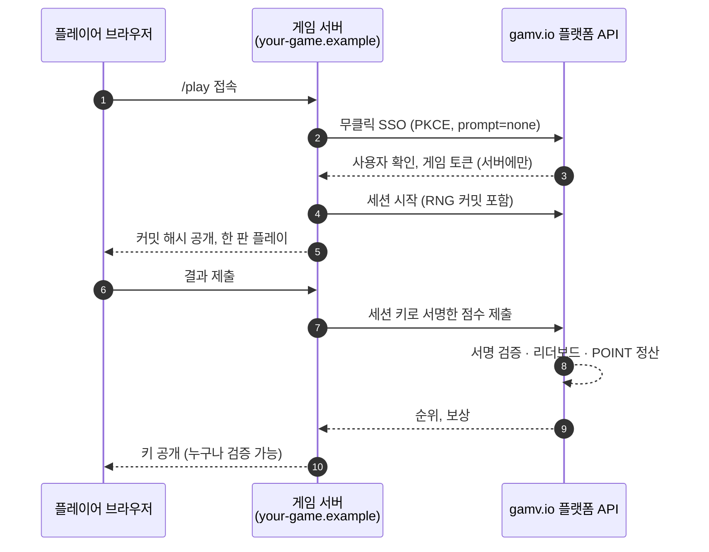
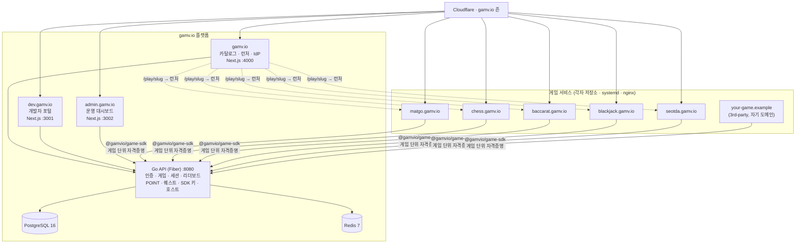

<div align="center">


# Gamvio

### 브라우저 게임 퍼블리셔 플랫폼

**설치 없이 바로 플레이 · POINT 보상 · gamv.io 계정 하나로 어떤 게임에든 로그인 · 자기 도메인에서 게임 퍼블리시**

[](https://gamv.io)
[](https://gamv.io/developers)
[](https://www.npmjs.com/package/@gamvio/game-sdk)

<sub>Gamvio is a Korean-first browser game publisher: play 90+ instant games on gamv.io, earn POINT, and ship your own game on your own domain with "Sign in with gamv.io".</sub>

</div>

---

## Gamvio는 무엇인가

Gamvio는 게임사와 플레이어 사이에 서는 **퍼블리셔**입니다. gamv.io가 카탈로그, 로그인, 리더보드, POINT 경제, 광고와 정산을 맡고, 게임은 저마다의 도메인에서 돕니다. 플레이어는 gamv.io 계정 하나로 어떤 게임에도 클릭 없이 들어가고, 개발자는 SDK와 템플릿으로 자기 게임을 십 분 안에 플랫폼에 연결합니다.

<table>
<tr>
<td width="50%" valign="top">

### 🎮 플레이어

- **90개 이상의 즉시 실행 게임** — 아케이드, 퍼즐, 보드, 카드, 두뇌, 캐주얼
- **POINT 보상** — 플레이, 일일 퀘스트, 체크인 스트릭, 업적
- **리더보드** — 게임마다 전체·주간 순위
- **한 번의 로그인** — Google·Kakao로 가입하고, 모든 게임 사이트에 무클릭 SSO
- **한국어 우선 UI** — 영어는 `?locale=en`

</td>
<td width="50%" valign="top">

### 🛠️ 개발자

- **한 줄로 시작** — `npx create-gamvio-game my-game`
- **자기 도메인에서 운영** — 플랫폼 비밀 없이, 게임 단위 자격증명만으로
- **Sign in with gamv.io** — PKCE 인가 코드 + 서버 측 BFF, 토큰은 브라우저에 닿지 않음
- **공정성 증명 RNG** — 커밋을 먼저 보이고 키를 나중에 공개
- **안티치트 점수** — 세션 키로 서명한 점수만 리더보드에 반영
- **목(mock) 플랫폼** — 계정 없이 `pnpm dev:mock`으로 전체 흐름 로컬 재현

</td>
</tr>
</table>

---

## 10분 만에 로그인된 플레이어

```bash
# 1. 템플릿 스캐폴딩 (Next.js 15, gamv.io SSO, 공정성 증명 샘플 게임, 리더보드 포함)
npx create-gamvio-game my-game
cd my-game && pnpm install

# 2. 계정 없이 먼저 실행 — 목 gamv.io 위에서 "Demo Player"가 로그인된 상태로 시작
pnpm dev:mock            # http://localhost:4199/play

# 3. gamv.io/developers 에서 게임과 테스트 키를 만들고 설정
cp .env.example .env.local
pnpm dev                 # 실제 gamv.io 로그인
```

### 한 판이 도는 방식



> **비밀은 서버에만.** 클라이언트 ID·시크릿, 세션 키, RNG 키는 게임 서버를 벗어나지 않습니다. 돈이 움직이는 기능(POINT 지급·차감, 판돈, 한도, 연령 확인, 킬스위치)은 게임이 아니라 플랫폼 API가 강제합니다.

---

## 저장소

### 🧩 플랫폼

| 저장소 | 설명 |
|:--|:--|
| [**gamv-web**](https://github.com/gamv-io/gamv-web) | 핵심 모노레포 — gamv.io 웹, 개발자 포털, 관리자, Go API, SDK·킷 패키지, 게임 서비스 템플릿, 문서와 계획 |
| [**gamv-api**](https://github.com/gamv-io/gamv-api) · [**gamv-dev-portal**](https://github.com/gamv-io/gamv-dev-portal) · [**gamv-admin**](https://github.com/gamv-io/gamv-admin) | Go API, 개발자 포털, 운영 대시보드의 초기 분리 스냅숏 — 정본은 gamv-web의 `apps/` |
| [**infra**](https://github.com/gamv-io/infra) | docker-compose(PostgreSQL 16 · Redis 7), 서버 셋업, 보안 점검, 이미지 생성 스크립트 |

### 🔧 개발자 도구

| 저장소 | 설명 | |
|:--|:--|:--|
| [**game-sdk**](https://github.com/gamv-io/game-sdk) | `@gamvio/game-sdk` — gamv.io SSO(BFF), 게임 단위 자격증명, 봉인 티켓, 세션, 안티치트 점수, 리더보드, 광고 | [](https://www.npmjs.com/package/@gamvio/game-sdk) |
| [**gamvio-game-template**](https://github.com/gamv-io/gamvio-game-template) | 독립형 Next.js 15 게임 템플릿 — 로그인·세션·리더보드가 배선된 공정성 증명 주사위 게임 | |
| [**create-gamvio-game**](https://github.com/gamv-io/create-gamvio-game) | 템플릿을 한 줄로 받는 CLI — `npx create-gamvio-game` | [](https://www.npmjs.com/package/create-gamvio-game) |

### 🃏 1st-party 게임 서비스

각 게임은 자기 저장소와 서비스로 `<slug>.gamv.io`에서 돌며, `/`는 게임 소개, `/play`는 단독 플레이입니다. 로그인은 언제나 gamv.io 계정입니다.

| 저장소 | 게임 | 호스트 |
|:--|:--|:--|
| [**game-matgo**](https://github.com/gamv-io/game-matgo) | 맞고 | `matgo.gamv.io` |
| [**game-chess**](https://github.com/gamv-io/game-chess) | 체스 | `chess.gamv.io` |
| [**game-baccarat**](https://github.com/gamv-io/game-baccarat) | 바카라 (Punto Banco) | `baccarat.gamv.io` |
| [**game-blackjack**](https://github.com/gamv-io/game-blackjack) | 블랙잭 | `blackjack.gamv.io` |
| [**game-seotda**](https://github.com/gamv-io/game-seotda) | 섯다 | `seotda.gamv.io` |
| [**games**](https://github.com/gamv-io/games) | 단일 파일 캐주얼 게임 컴포넌트 66종 (2048, 테트리스, 오목, 윷놀이 …) | gamv.io 내장 |

---

## 아키텍처



| 계층 | 기술 |
|:--|:--|
| **프론트엔드** | Next.js 15 (App Router) · React 19 · TypeScript · Tailwind CSS 4 · shadcn/ui |
| **백엔드** | Go 1.24 · Fiber v2 · pgx · PostgreSQL 16 · Redis 7 |
| **인증** | Google · Kakao OAuth · gamv.io OIDC (PKCE S256, 서버 측 BFF, 봉인 `__Host-` 쿠키) |
| **게임 SDK** | `@gamvio/game-sdk` (SSO, 세션, 서명 점수, 리더보드, 광고) · `@gamvio/game-kit` (공정성 증명 RNG, 사운드, 아이콘, 문자열) |
| **경제** | POINT · GAMV · Xphere (EVM 호환) |
| **인프라** | GCP VM · Nginx · systemd · Docker · Cloudflare · GitHub Actions |
| **품질** | Biome · Vitest · Playwright · Go test · 마이그레이션 검사 |

---

## 게임 카탈로그

| 분류 | 예시 |
|:--|:--|
| 🕹️ **아케이드** | 테트리스, 스네이크, 플래피 점프, 스페이스 인베이더, 브레이크아웃, 픽셀 러너 |
| 🧩 **퍼즐** | 2048, 스도쿠, 지뢰찾기, 헥스 퍼즐, 파이프 커넥트, 소코반 |
| 🎲 **보드** | 맞고, 고스톱, 바둑, 오목, 체스, 장기, 윷놀이, 블루마블 |
| 🃏 **카드** | 바카라, 블랙잭, 섯다, 텍사스 홀덤, 바둑이, 원카드, 세븐 포커 |
| 🧠 **두뇌** | 수학 스프린트, 단어 섞기, 끝말잇기, 크로스워드, 타자 경주, 스피드 퀴즈 |
| 🎯 **캐주얼** | 버블 슈터, 컬러 매치, 타워 스택, 다트, 미니 골프, 루도 파티 |

---

## 링크

| | |
|:--|:--|
| 🌐 **플랫폼** | [gamv.io](https://gamv.io) |
| 🛠️ **개발자 포털** | [gamv.io/developers](https://gamv.io/developers) |
| 📖 **SDK 문서** | [gamv.io/developers/docs](https://gamv.io/developers/docs) |
| 📡 **API 레퍼런스** | [gamv.io/developers/api](https://gamv.io/developers/api) |
| 📦 **npm** | [@gamvio/game-sdk](https://www.npmjs.com/package/@gamvio/game-sdk) · [create-gamvio-game](https://www.npmjs.com/package/create-gamvio-game) |

---

<div align="center">

**Built in Seoul 🇰🇷**

[게임 하기](https://gamv.io) · [게임 만들기](https://gamv.io/developers) · [SDK 문서](https://gamv.io/developers/docs)

</div>
